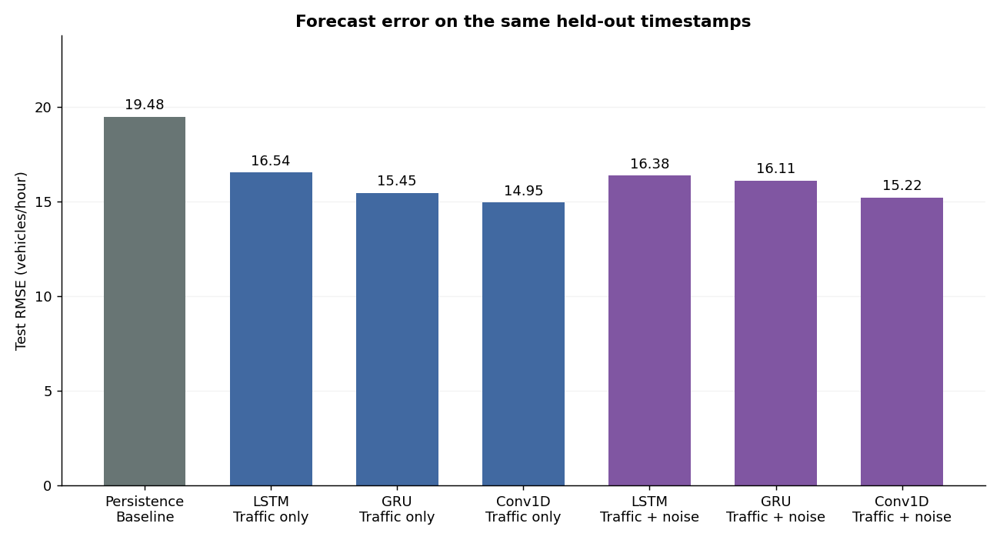
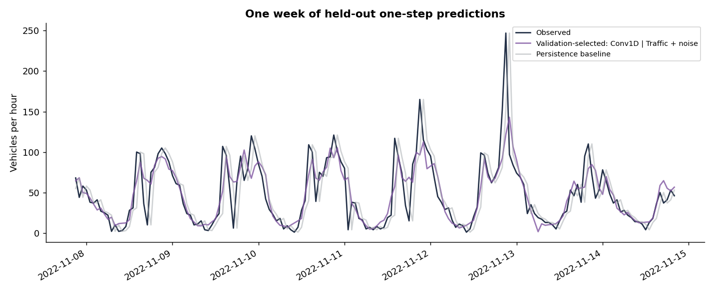

# Urban Traffic Forecasting

Can environmental noise help predict next-hour traffic?

This project compares **LSTM, GRU and Conv1D** using traffic alone and traffic with environmental noise. It builds on my individual 2025 coursework at Budapest University of Technology and Economics. This reviewed portfolio revision restores the original neural-network architectures and training settings while correcting data preparation and evaluation.

**Included run:** validation selected **Conv1D, Traffic + noise**. Its held-out test RMSE is **15.22 vehicles/hour**, versus **19.48** for persistence (21.9% lower). These are regenerated results for this revision, not the original smoothed-target scores.



## Start here

Open [traffic_forecasting.ipynb](traffic_forecasting.ipynb) to read the executed analysis and full modeling code. To run it locally, follow [START_HERE.md](START_HERE.md): extract the whole package, install the requirements in a Python 3.11 or 3.12 kernel, then restart the kernel and run every cell. **Training is enabled by default.** Progress is printed for each model and epoch.

```bash
python -m pip install -r requirements.txt
python -m jupyterlab
```

The equivalent command-line run is:

```bash
python forecasting.py --epochs 50 --batch-size 32
```

The notebook contains all pipeline definitions and does not import `forecasting.py`; the script supports the equivalent command-line workflow. Both use the CSVs in `data/`.

## Data and forecasting question

The supplied coursework extracts contain Dublin traffic counts and environmental noise for May–December 2022. This analysis selects SCATS **site 755, detector 1**. The original report identifies Ballymun Road and Sonitus sensor 4; sensor proximity has not been independently reconstructed from the extract.

`Sum_Volume` is the vehicle count for the hour ending at its timestamp; `LAeq` is environmental noise in dB. The overlap runs from 1 May 2022, 01:00 through 25 December 2022, 13:00. **Nine previous hourly observations predict the next hourly traffic count.** No future noise is used.

The experiment evaluates rolling one-step predictions. Earlier observed test hours can become inputs to later test predictions. It does not predict the entire test period from a single starting point.

## Data preparation and evaluation

- Keep recorded zero traffic counts. Exclude both conflicting readings at each of three duplicate timestamps.
- Reindex hourly and forward-fill input gaps for at most two hours using only the past. Exclude windows still incomplete. Never fill missing target counts.
- Use raw traffic and noise without exponential smoothing. Fit input and target scaling only on training data.
- Establish chronological 60/20/20 time boundaries. Validation begins 21 September 2022, 04:00; testing begins 7 November 2022, 21:00.
- Use identical eligible targets for all variants: 3,423 training, 1,142 validation and 1,145 test windows.
- Select by validation RMSE. Report test MAE and RMSE after converting predictions back to vehicle-count units.
- Compare with persistence, which predicts the latest available hourly traffic feature.

## Original models restored

| Variant | Main layers | Dropout after each main layer |
| --- | --- | --- |
| Traffic-only LSTM | 64 → 32 units | 40% |
| Traffic + noise LSTM | 64 → 32 units | 30% |
| Both GRU variants | 64 → 32 units | 30% |
| Both Conv1D variants | 64 → 32 filters, kernel 2, same padding, ReLU | 30% |

All models finish with Dense 8 (ReLU) and Dense 1 (linear); Conv1D uses Flatten first. Training uses Adam at 0.001, MSE loss, batch size 32 and up to 50 epochs. Early stopping uses validation loss with patience 5 and restores best weights. Learning-rate reduction halves the rate after 3 epochs without improvement. Best model checkpoints are saved.

**Interpretation detail:** the original LSTM variants have different dropout rates. Their comparison changes both features and regularization, so its difference cannot be attributed solely to adding noise. GRU and Conv1D retain matched architectures across feature variants.

## Results

Lower error is better. A fixed seed of 42 was used; the full environment is recorded in `results/run_config.json`.

| Model | Inputs | Epochs run | Validation RMSE | Test MAE | Test RMSE |
| --- | --- | ---: | ---: | ---: | ---: |
| Persistence | Baseline | 0 | 24.14 | 12.76 | 19.48 |
| LSTM | Traffic only | 49 | 19.77 | 11.48 | 16.54 |
| GRU | Traffic only | 49 | 19.14 | 10.61 | 15.45 |
| Conv1D | Traffic only | 35 | 18.24 | 10.18 | 14.95 |
| LSTM | Traffic + noise | 45 | 19.50 | 11.30 | 16.38 |
| GRU | Traffic + noise | 28 | 19.66 | 10.99 | 16.11 |
| Conv1D | Traffic + noise | 25 | 18.09 | 10.32 | 15.22 |



A single run does not establish general superiority of an architecture or feature set. Test scores are reported for transparency; future tuning should use validation periods rather than repeatedly optimizing this test result.

## Outputs and reuse

| File or folder | Purpose |
| --- | --- |
| `traffic_forecasting.ipynb` | Full source and executed notebook outputs |
| `forecasting.py` | Equivalent command-line pipeline |
| `START_HERE.md` | Jupyter setup instructions |
| `REVIEWED_CHANGES.md` | Changes agreed during the review |
| `requirements.txt` | Tested core dependency versions |
| `data/` | Supplied extracts and attribution |
| `results/` | Metrics, predictions, histories, quality checks and run configuration |
| `figures/` | Data, errors, prediction and training charts |
| `models/` | Best checkpoints and fitted scalers for local reuse |

The notebook's final code cell reloads a saved model and verifies its predictions. Saved models expect scaled inputs and return scaled predictions; reuse `models/preprocessing.joblib`. Generated models are excluded by `.gitignore` and need not be included in a GitHub upload.

## Limitations

One detector, one test period and one random seed limit generalization. The supplied CSVs are already processed extracts with incomplete earlier preprocessing records. Timestamps lack timezone metadata; daylight-saving alignment is unverified. Short fills and detector faults can affect outcomes. The two-hour fill limit is a practical assumption, not a tuned optimum.

Next steps include seasonal baselines, repeated seeds, temporal cross-validation and additional locations. See [data attribution](data/README.md) for the official dataset catalogs and [reviewed changes](REVIEWED_CHANGES.md) for differences from the original notebook.

## Author

**Ali Mehrabi** — Computer Science student, Budapest University of Technology and Economics.  
[GitHub: ALI-MEHRABI1382](https://github.com/ALI-MEHRABI1382)
